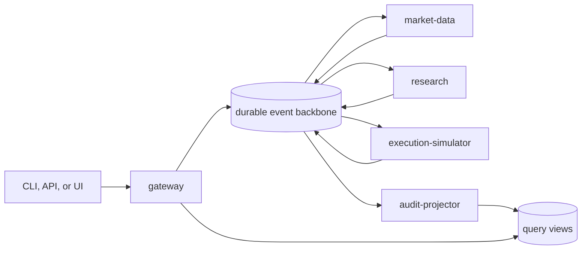

# EdgeAgent

## TL;DR

- EdgeAgent is an open-source, event-driven market research and dry-run trading platform implemented as a Rust monorepo.
- One Cargo workspace produces independently deployable gateway, market-data, research, execution-simulator, and audit-projector components.
- Deterministic services own evidence, analytics, policy, simulated fills, positions, and P&L; models may explain validated facts but cannot create them.
- Versioned commands and events use at-least-once delivery, transactional outbox/inbox records, and idempotent state transitions.
- The same signed OCI images target portable Kubernetes and managed GCP, Azure, and AWS deployment profiles.
- There is no live broker path: unsupported execution modes fail closed, and the simulator contains no broker adapter or credentials.
- The project is in **M01 - Rust engineering foundation**; the buildable workspace and service composition roots are established, while network and domain workflows remain intentionally absent.

## What EdgeAgent is

EdgeAgent converts a bounded research request into an auditable, time-limited
artifact for liquid U.S.-listed equities and ETFs. A caller can then submit an
authorized dry-run market or limit order. The platform simulates order state,
fills, positions, cash, and P&L using point-in-time observations and versioned
spread, slippage, fee, latency, liquidity, gap, halt, and corporate-action rules.

The project doubles as a reference architecture for production-oriented Rust:
small service boundaries, durable asynchronous workflows, immutable artifacts,
provider-neutral ports, observable failures, and deployment conformance across
clouds. It deliberately demonstrates distributed-systems mechanics while
keeping domain code independent of brokers, clouds, databases, message buses,
models, and user interfaces.

## What EdgeAgent is not

EdgeAgent is not a brokerage, custody platform, source of guaranteed returns,
or personalized financial adviser. It cannot connect to a brokerage account or
transmit a live order. The initial scope excludes options, leverage, short
selling, micro-cap securities, and individualized portfolio optimization.

## Architecture at a glance



Local and portable deployments use NATS JetStream, PostgreSQL, S3-compatible
object storage, and OpenTelemetry. Cloud-managed adapters must preserve the
same contracts for delivery, idempotency, ordering, retention, security, and
recovery. See [Deployment portability](docs/architecture/deployment-portability.md)
for the GCP, Azure, AWS, and Kubernetes capability matrix.

## Engineering principles

- **Evidence before narrative:** every numeric or time-sensitive claim and simulated fill links to source evidence and deterministic transformations.
- **Policy before action:** models and adapters cannot bypass data-quality, product, risk, or dry-run controls.
- **Dry-run by construction:** no live mode, broker adapter, broker credential, or broker endpoint exists in the execution simulator.
- **At-least-once honesty:** duplicate and delayed delivery are normal; consumers are idempotent and poison messages are quarantined.
- **Point-in-time integrity:** research and evaluation exclude hindsight, look-ahead, survivorship bias, and silent strategy revision.
- **Build once, deploy many:** environments promote identical signed OCI image digests rather than rebuilding per provider.
- **Open-source reproducibility:** default verification requires no paid service, private dataset, credential, or public cloud.

## Repository map

- [Product vision](docs/product/vision.md)
- [System architecture](docs/architecture/system-overview.md)
- [Deployment portability and multi-cloud matrix](docs/architecture/deployment-portability.md)
- [Implementation milestones](docs/roadmap/milestones.md)
- [Architecture decisions](docs/decisions/README.md)
- [Contributor workflow](CONTRIBUTING.md)
- [Engineering standards](docs/development/engineering-standards.md)
- [Security policy](SECURITY.md)
- [Code of conduct](CODE_OF_CONDUCT.md)

## Workspace

The initial workspace contains:

- `edgeagent-contracts`, which owns stable component identities and descriptor validation;
- `edgeagent-service-runtime`, which provides the common bootstrap command surface; and
- five independently buildable service binaries under `services/`.

Each binary currently supports `describe`, `self-check`, `version`, and `help`.
These commands prove packaging and ownership without implying that HTTP,
messaging, persistence, or trading workflows already exist. For example:

```text
cargo run -p edgeagent-gateway -- describe
cargo run -p edgeagent-execution-simulator -- self-check
```

## Verify the current foundation

Install Python 3.11 or newer and the toolchain pinned by
`rust-toolchain.toml`, then run:

```text
python scripts/verify_repository.py --format-check
python scripts/verify_architecture.py
python scripts/verify_repository.py
python -m unittest discover -s tests -p "test_*.py"
cargo fmt --all --check
cargo check --workspace --all-targets
cargo clippy --workspace --all-targets -- -D warnings
cargo test --workspace --all-targets
```

Use `python3` on POSIX or `py -3` on Windows when appropriate. On systems with
`make`, `make verify PYTHON=python3` runs the same checks. Default verification
uses no external service, credential, paid data, or network request.

## Contributing

Read [AGENTS.md](AGENTS.md) and [CONTRIBUTING.md](CONTRIBUTING.md) before making
changes. The project favors one independently reviewable capability per issue
and pull request. Never commit credentials, personal data, licensed market-data
payloads, private prompts, or local model artifacts.

## License

EdgeAgent is licensed under the [Apache License 2.0](LICENSE).
