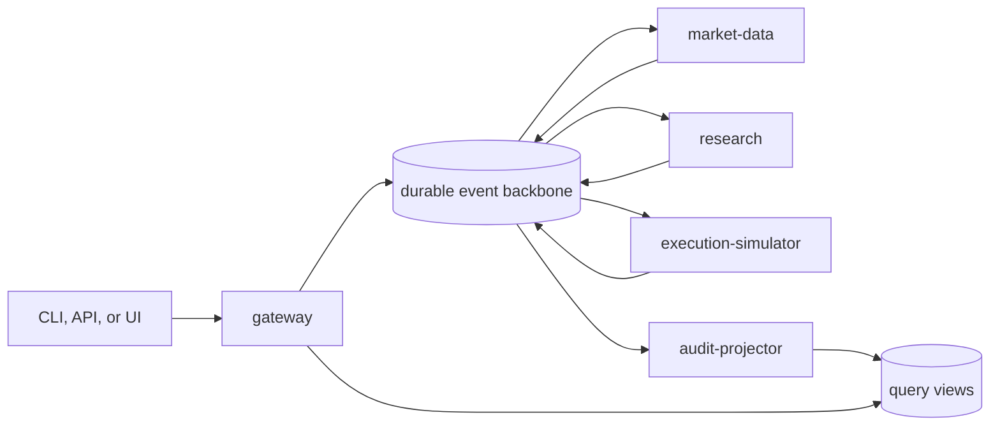

# EdgeAgent

## TL;DR

- EdgeAgent is an open-source, event-driven market research and dry-run trading platform implemented as a Rust monorepo.
- One Cargo workspace produces independently deployable gateway, market-data, research, execution-simulator, and audit-projector components.
- Deterministic services own evidence, analytics, policy, simulated fills, positions, and P&L; models may explain validated facts but cannot create them.
- Versioned commands and events use at-least-once delivery, transactional outbox/inbox records, and idempotent state transitions.
- The same signed OCI digest targets portable Kubernetes and managed GCP, Azure, and AWS deployment profiles.
- Separate UI and GitOps repositories consume versioned gateway contracts and immutable release digests without owning domain behavior.
- There is no live broker path: unsupported execution modes fail closed, and the simulator contains no broker adapter or credentials.
- The project is in **M02 - Contracts and event spine**; the first validated
  CloudEvents message primitive is implemented, while transport, persistence,
  and domain workflows remain intentionally absent.

## What EdgeAgent is

EdgeAgent converts a bounded research request into an auditable, time-limited
artifact for liquid U.S.-listed equities and ETFs. A caller can then submit an
authorized dry-run market or limit order. The platform simulates order state,
fills, positions, cash, and P&L using point-in-time observations and versioned
spread, slippage, fee, latency, liquidity, gap, halt, and corporate-action rules.

The project doubles as a reference architecture for production-oriented Rust:
small service boundaries, durable asynchronous workflows, immutable artifacts,
provider-neutral ports, observable failures, and deployment conformance across
clouds. It deliberately demonstrates distributed-systems mechanics while
keeping domain code independent of brokers, clouds, databases, message buses,
models, and user interfaces.

## What EdgeAgent is not

EdgeAgent is not a brokerage, custody platform, source of guaranteed returns,
or personalized financial adviser. It cannot connect to a brokerage account or
transmit a live order. The initial scope excludes options, leverage, short
selling, micro-cap securities, and individualized portfolio optimization.

## Architecture at a glance



Local and portable deployments use NATS JetStream, PostgreSQL, S3-compatible
object storage, and OpenTelemetry. Cloud-managed adapters must preserve the
same contracts for delivery, idempotency, ordering, retention, security, and
recovery. See [Deployment portability](docs/architecture/deployment-portability.md)
for the GCP, Azure, AWS, and Kubernetes capability matrix.

The broader project uses explicit repository boundaries:

- [`edge-agent-ui`](https://github.com/stanimirivanov/edge-agent-ui) owns the untrusted browser experience and calls only the gateway API;
- [`edge-agent-gitops`](https://github.com/stanimirivanov/edge-agent-gitops) owns environment desired state and immutable release selection; and
- [`k8s-infrastructure`](https://github.com/stanimirivanov/k8s-infrastructure) owns project-neutral substrates and Argo CD installation.

See [ADR-0004](docs/decisions/0004-separate-application-ui-gitops-and-substrate-ownership.md)
for the complete ownership, security, and handoff contract.

## Engineering principles

- **Evidence before narrative:** every numeric or time-sensitive claim and simulated fill links to source evidence and deterministic transformations.
- **Policy before action:** models and adapters cannot bypass data-quality, product, risk, or dry-run controls.
- **Dry-run by construction:** no live mode, broker adapter, broker credential, or broker endpoint exists in the execution simulator.
- **At-least-once honesty:** duplicate and delayed delivery are normal; consumers are idempotent and poison messages are quarantined.
- **Point-in-time integrity:** research and evaluation exclude hindsight, look-ahead, survivorship bias, and silent strategy revision.
- **Build once, deploy many:** environments promote identical signed OCI image digests rather than rebuilding per provider.
- **Open-source reproducibility:** default verification requires no paid service, private dataset, credential, or public cloud.

## Repository map

- [Product vision](docs/product/vision.md)
- [System architecture](docs/architecture/system-overview.md)
- [Deployment portability and multi-cloud matrix](docs/architecture/deployment-portability.md)
- [Implementation milestones](docs/roadmap/milestones.md)
- [Architecture decisions](docs/decisions/README.md)
- [Contributor workflow](CONTRIBUTING.md)
- [Engineering standards](docs/development/engineering-standards.md)
- [Message envelope contract](docs/development/message-contracts.md)
- [Local platform profile](docs/development/local-platform.md)
- [Dependency and artifact supply chain](docs/development/supply-chain.md)
- [Signed OCI releases](docs/development/releases.md)
- [Security policy](SECURITY.md)
- [Code of conduct](CODE_OF_CONDUCT.md)

## Workspace

The initial workspace contains:

- `edgeagent-contracts`, which owns stable component identities, descriptor
  validation, and the validated CloudEvents message envelope;
- `edgeagent-service-runtime`, which provides the common bootstrap command surface; and
- five independently buildable service binaries under `services/`.

Each binary currently supports `describe`, `self-check`, `version`, and `help`.
These commands prove packaging and ownership without implying that HTTP,
messaging, persistence, or trading workflows already exist. For example:

```text
cargo run -p edgeagent-gateway -- describe
cargo run -p edgeagent-execution-simulator -- self-check
```

## Message contracts

`edgeagent-contracts` now provides a transport-neutral CloudEvents 1.0
structured JSON envelope. Callers supply deterministic message, correlation,
causation, idempotency, partition, timestamp, schema, and trace metadata. The
contract validates those values before serialization and again after decoding,
then exposes typed payload decoding.

A validated message registry derives stable `edgeagent.command.*` and
`edgeagent.event.*` subjects, assigns one command handler or authoritative
event producer, enforces partition namespaces and a 256 KiB portable envelope
limit, and declares work-queue or replay retention semantics. A committed
golden fixture fixes the initial wire representation.

The contract does not generate identifiers, read the wall clock, connect to
NATS, persist an outbox or inbox, or validate a domain payload against a
generated schema. Those capabilities remain separate M02 increments. See the
[message contract guide](docs/development/message-contracts.md).

## OCI images

One parameterized [Dockerfile](Dockerfile) builds every service declared in
[deploy/images.toml](deploy/images.toml). It compiles the locked workspace in
a Rust Alpine builder and copies one statically linked binary into a `scratch`
runtime image. The runtime uses numeric user and group `65532`, contains no
shell or package manager, and carries standard source, revision, and license
labels.

Build and inspect one service:

```text
docker build --build-arg SERVICE=gateway --build-arg SOURCE_REVISION=local -t edgeagent/gateway:local .
docker run --rm --network=none --read-only --cap-drop=ALL edgeagent/gateway:local describe
```

`make image-smoke` builds all five images, validates their configured non-root
identity and entrypoint, executes each descriptor under a read-only and
networkless runtime, rejects an unknown service, and removes its test tags.
Docker is optional for normal local verification; the Ubuntu CI image job is
authoritative for container smoke tests.

## Local dependencies

The checked-in Compose profile provides PostgreSQL, NATS JetStream, SeaweedFS
S3-compatible storage, and an OpenTelemetry Collector. All published ports bind
to `127.0.0.1`, and the credentials are visibly local test values.

```text
make local-up
make local-status
make local-down
```

`local-down` preserves named volumes. See the
[local platform guide](docs/development/local-platform.md) for endpoints,
readiness behavior, security limits, troubleshooting, and explicit state reset.

## Dependency and artifact governance

The committed Cargo lockfile is mandatory, and `deny.toml` defines the accepted
advisory, maintenance, source, version, and license policy. The supply-chain CI
job refreshes RustSec data and produces two CycloneDX documents for every
deployable declared in `deploy/images.toml`: a Cargo dependency SBOM and an OCI
runtime-filesystem SBOM. It validates the complete ten-artifact set before
uploading it as short-lived workflow evidence.

Run the static, offline policy check with normal verification. With the pinned
`cargo-deny`, `cargo-cyclonedx`, Syft, and Docker available, run the full local
pipeline with `make supply-chain`. See the
[supply-chain guide](docs/development/supply-chain.md) for policy, exception,
artifact, failure, and tool-installation details. A SemVer tag builds each
declared image once, publishes it to GHCR, attaches provenance and CycloneDX
SBOM attestations to the immutable digest, and signs that digest through GitHub
OIDC. See [signed OCI releases](docs/development/releases.md).

## Verify the current foundation

Install Python 3.11 or newer and the toolchain pinned by
`rust-toolchain.toml`, then run:

```text
python scripts/verify_repository.py --format-check
python scripts/verify_repository.py
python scripts/verify_architecture.py
python scripts/verify_images.py
python scripts/verify_local_stack.py
python scripts/verify_supply_chain.py
python scripts/verify_release.py
python -m unittest discover -s tests -p "test_*.py"
cargo fmt --all --check
cargo metadata --locked --offline --format-version 1 --no-deps
cargo check --locked --workspace --all-targets
cargo clippy --locked --workspace --all-targets -- -D warnings
cargo test --locked --workspace --all-targets
```

Use `python3` on POSIX or `py -3` on Windows when appropriate. On systems with
`make`, `make verify PYTHON=python3` runs the same checks. Default verification
uses no external service, credential, paid data, or network request.

## Contributing

Read [AGENTS.md](AGENTS.md) and [CONTRIBUTING.md](CONTRIBUTING.md) before making
changes. The project favors one independently reviewable capability per issue
and pull request. Never commit credentials, personal data, licensed market-data
payloads, private prompts, or local model artifacts.

## License

EdgeAgent is licensed under the [Apache License 2.0](LICENSE).
