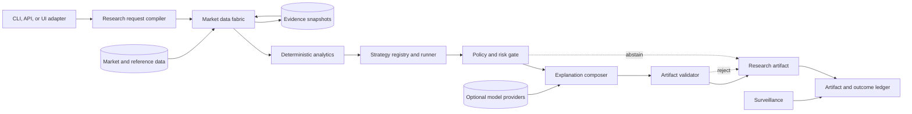

# EdgeAgent system architecture

## TL;DR

- EdgeAgent is a modular monolith first: domain capabilities remain separated in code while one deployable process proves the workflow.
- A typed request flows through evidence acquisition, deterministic analysis, strategy ranking, policy, validated explanation, publication, and lifecycle tracking.
- Market-data and model providers are replaceable adapters; they never own domain meaning.
- The language model is optional and untrusted. The deterministic artifact remains useful without it.
- The system fails closed on invalid critical evidence, policy failure, or numeric inconsistency and supports an explicit degraded state for noncritical loss.
- Persistence, queues, distributed workers, and UI frameworks are introduced only when a vertical slice demonstrates the need.

## Context and quality priorities

EdgeAgent produces time-sensitive market research from heterogeneous and
potentially adversarial evidence. Correct-looking output can still be wrong
because of stale data, symbol ambiguity, corporate actions, hindsight leakage,
unit mistakes, prompt injection, or an undocumented strategy revision.

The architecture therefore prioritizes, in order:

1. evidence integrity and point-in-time reproducibility;
2. deterministic calculation and policy enforcement;
3. explicit uncertainty and safe abstention;
4. testability and provider portability;
5. bounded reliability and operational diagnosis; and
6. latency and throughput within declared service objectives.

The initial topology is a modular monolith with in-process capability calls and
file-backed synthetic fixtures. This keeps failure and deployment semantics
simple while preserving ports at actual external boundaries. Components move
to separate processes only when measured scaling, isolation, ownership, or
availability requirements justify the operational cost.

## System context

Solid arrows represent typed application flow. Provider payloads and generated
content cross untrusted adapter boundaries. An abstention is a first-class
artifact result, not an exception hidden from the requester.

## Capability boundaries

### Research request compiler

The compiler validates transport input and constructs one domain request. It
resolves the universe, effective time, market calendar, horizon, allowed
strategy versions, benchmark, hypothetical risk constraints, and maximum
evidence age.

It rejects ambiguous symbols, unsupported instruments, impossible time ranges,
unknown strategies, excessive universe or lookback size, and conflicting
constraints. Natural-language parsing, when added, is an inbound adapter: the
compiler remains authoritative.

### Market data fabric

The data fabric owns provider acquisition and normalization. Each observation
includes:

- stable instrument and venue identity;
- raw symbol supplied by the provider;
- currency and units;
- event and observation timestamps;
- source and provider revision;
- raw or adjusted basis and corporate-action revision;
- entitlement/redistribution class;
- freshness and quality flags; and
- integrity hash for retained evidence.

Adapters convert vendor payloads into the canonical contract. Validation checks
market calendars, monotonic time, duplicate bars, impossible OHLC relations,
negative volume, gaps, stale observations, outliers, and cross-source conflict.
A fallback source is eligible only if it preserves required semantics and rights.

### Evidence snapshots and graph

A snapshot freezes the evidence visible to one decision. The evidence graph
links derived values and material claims to snapshot items and transformation
revisions. The graph supports replay and shows why an artifact was produced.

The initial implementation may use deterministic files and content hashes. An
object store or database is not required until artifacts must survive beyond a
local process. Retention must respect source licenses; an evidence identifier
does not authorize redistribution of the underlying payload.

### Deterministic analytics runtime

The analytics runtime computes indicators, fundamental ratios, liquidity,
volatility, returns, drawdown, and risk illustrations. Functions declare input
schema, units, lookback, missing-data policy, adjustment basis, version, and
numeric tolerance.

Calculations are pure where practical. Caching may accelerate a calculation but
is not authoritative. A cache key includes evidence and transformation versions,
not only ticker and date.

### Strategy registry and runner

A strategy version declares:

- name, semantic version, owner, and validation status;
- eligible instruments and minimum data quality;
- required features and lookbacks;
- scoring, ranking, and tie-break rules;
- horizon, expiry, benchmark, and regime assumptions;
- invalidation and rejection conditions; and
- evaluation evidence and maximum-drawdown policy.

Only approved versions may publish artifacts. Experimental strategies run in a
separate mode and cannot silently replace an approved version. Ranking is
deterministic for identical inputs.

### Policy and risk gate

The policy gate evaluates product scope, evidence quality, strategy status,
liquidity, volatility, price gaps, concentration assumptions, unsupported
requests, and required disclosures. It returns a typed decision:

- `approved` — all required controls pass;
- `narrowed` — optional capabilities are removed while the remaining result is valid;
- `abstained` — evidence cannot support a conclusion;
- `rejected` — the request or result violates a hard policy; or
- `withdrawn` — a previously published artifact can no longer be relied upon.

Policy versions are immutable inputs to publication and replay. No model or
presentation adapter can change a decision.

### Explanation composer and artifact validator

The composer receives only approved structured facts. A deterministic renderer
is the baseline. An optional language-model adapter may improve organization or
plain-language explanation under a schema and evidence allowlist.

The validator reparses the proposed artifact and verifies every identifier,
numeric value, timestamp, unit, evidence reference, status, and required
disclosure against approved inputs. Unknown fields, unsupported claims, invalid
citations, and numeric mismatches block publication. A failed model composition
may fall back to deterministic rendering; it cannot bypass validation.

### Artifact, simulation, and surveillance ledger

Publication writes an immutable artifact event. Lifecycle events append
invalidation, expiry, withdrawal, correction linkage, and paper outcome. The
ledger prevents hindsight edits and supports replay.

Simulation uses explicit fill timing, spread, slippage, fees, liquidity, gaps,
halts, corporate actions, and delistings. Surveillance reevaluates named
conditions and may append state; it cannot mutate an artifact or issue an order.

## End-to-end control flow

1. The inbound adapter authenticates or identifies the caller as required,
   applies transport limits, and parses unknown input into a request proposal.
2. The compiler validates domain meaning and creates a stable request identity.
3. The data fabric resolves stable instruments and acquires only the entitled,
   bounded evidence required by approved strategies.
4. Evidence validation emits either a usable snapshot, a narrowed snapshot with
   declared limitations, or a typed abstention.
5. Analytics compute versioned features. Failures identify their evidence and
   do not produce partial numbers disguised as complete output.
6. Eligible strategies score and rank candidates with deterministic tie-breaks.
7. Policy evaluates each candidate and the result set as a whole.
8. The composer renders approved facts. The artifact validator independently
   reconciles the complete output.
9. Publication appends the immutable artifact and audit event.
10. Simulation and surveillance append later observations without rewriting the original.

## Trust boundaries

| Boundary | Untrusted input | Required control |
|---|---|---|
| Client to intake | User text, API payload, files | Authentication where applicable, size limits, runtime schema, domain validation |
| Provider to data fabric | Quotes, bars, reference data, news, metadata | Adapter parsing, entitlement, freshness, semantic validation, source lineage |
| Retrieval to composition | News, filings, social or web content | Content/instruction isolation, allowlists, relevance and provenance checks |
| Model to application | Structured or narrative output | Schema parse, evidence allowlist, numeric reconciliation, policy recheck |
| Persistence to domain | Rows, blobs, events | Version validation, tenant/scope checks, integrity and state-transition validation |
| Operator to control plane | Configuration and administrative commands | Strong authentication, authorization, audit, bounded and reversible actions |

## Failure and degradation semantics

The system exposes three operating states:

- **Normal:** every required source and control satisfies policy.
- **Degraded:** a noncritical dependency is impaired. The system may use a
  qualified cache, alternate source, deterministic renderer, or smaller
  strategy set while labeling limitations.
- **Fail closed:** critical evidence, entitlement, authorization, strategy,
  policy, or artifact validation fails. No new research conclusion is published.

Retries apply only to classified transient failures, use bounded exponential
backoff and jitter, respect cancellation and provider limits, and never change
request identity. Permanent, semantic, authorization, and policy failures are
not retried. Partial work is either safely resumable from immutable inputs or discarded.

## Persistence and deployment evolution

The first vertical slice runs locally with synthetic fixtures and in-memory
repositories. Persistence is introduced when a use case requires replay across
process lifetimes. The expected production direction is:

- a relational system of record for requests, artifacts, configuration, and lifecycle state;
- immutable object storage for licensed evidence snapshots and evaluation data;
- an append-only audit/event representation; and
- a bounded cache that is never authoritative.

The exact runtime, database, migration runner, workflow engine, and deployment
platform require accepted ADRs before implementation. If PostgreSQL is selected,
tenant/scope invariants, UTC instants, exact units, and append-only evidence are
enforced in schema as well as application code.

Deployment begins as one signed artifact with isolated development, test, and
production configuration. Later process separation requires measured need and
defines service identity, compatibility, retry, delivery, recovery, and
observability before rollout.

## Observability and audit

Every request carries a correlation identifier that is not used for
authorization. Structured telemetry records stage, duration, outcome class,
provider/model adapter, strategy/policy version, freshness class, and bounded
reason codes. It excludes credentials, personal data, raw private prompts, and
licensed payloads.

Required health signals include request rate, stage latency, abstention/rejection
rate, provider freshness and disagreement, calculation and validation defects,
model fallbacks, replay drift, strategy distribution, queue depth when present,
and artifact lifecycle events. High-cardinality instrument or user identifiers
remain in protected diagnostic traces or audit records rather than metric labels.

## Initial acceptance boundary

The first architecture-validating slice uses a synthetic, point-in-time daily
bar fixture and one momentum strategy. It accepts a typed request and returns a
deterministically ranked artifact or one of several tested abstentions. It
requires no network, model, database, or UI.

This slice must prove stable identifiers, market time, evidence lineage,
feature versioning, deterministic ranking, policy outcomes, artifact immutability,
and replay. Only then should the project add a live data adapter, model-backed
explanation, persistence, or additional strategy.
