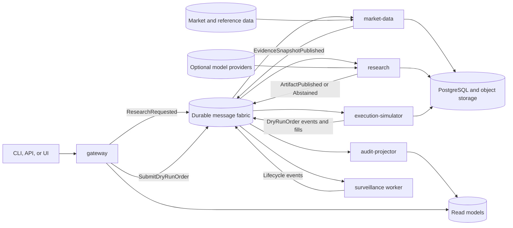

# EdgeAgent system architecture

## TL;DR

- EdgeAgent is a Rust workspace containing small, independently deployable services and workers with shared domain and contract crates.
- Services collaborate through versioned commands and events with at-least-once delivery, transactional outbox/inbox records, and idempotent consumers.
- Deterministic components own market facts, research, policy, dry-run fills, positions, and P&L; generated language remains optional and untrusted.
- The execution simulator accepts dry-run orders only and contains no broker credential, endpoint, or live-order adapter.
- Signed OCI images run under a portable Kubernetes profile or cloud-managed GCP, Azure, and AWS profiles.
- Every critical path fails closed on invalid evidence, authorization, policy, event compatibility, or numeric reconciliation.

## Context and architectural thesis

EdgeAgent is both a research system and a reference implementation of portable,
event-driven Rust architecture. Its decomposition must show credible service
boundaries without manufacturing dozens of empty microservices. Five initial
deployables own distinct data and scaling concerns:

1. `gateway` authenticates callers, validates transport input, and exposes
   request and query APIs.
2. `market-data` resolves instruments, acquires provider observations, validates
   them, and publishes immutable evidence snapshots.
3. `research` performs deterministic analytics, strategy evaluation, policy,
   explanation validation, and artifact publication.
4. `execution-simulator` processes dry-run orders, simulated fills, positions,
   cash, and P&L under explicit market assumptions.
5. `audit-projector` builds queryable lifecycle and audit views from retained
   events without becoming the source of domain truth.

This separation is intentional for the portfolio objective. The project accepts
the extra contract, deployment, and operational work, then controls it through a
single Cargo workspace, a small service count, shared infrastructure crates,
and automated conformance tests.

## Quality priorities

The architecture prioritizes, in order:

1. evidence integrity and point-in-time reproducibility;
2. deterministic calculation, policy, and execution simulation;
3. prevention of any live execution path;
4. explicit uncertainty and safe abstention;
5. event correctness, idempotency, and recoverability;
6. deployment portability and observable operation; and
7. latency and throughput within declared service objectives.

## System context



Commands express a requested action and have one intended owner. Events describe
a completed fact and may have multiple consumers. Both use CloudEvents envelopes,
versioned payloads, correlation and causation identifiers, an idempotency key,
event time, producer identity, schema version, and trace context.

## Repository and deployment structure

The product spans four repositories with explicit handoffs. The Cargo
workspace keeps runtime boundaries visible while separate repositories own the
browser experience, environment desired state, and reusable substrate:

```text
edge-agent/
  crates/                 # domain, application, contracts, adapters, testing
  services/               # independently deployable Rust composition roots
  workers/                # asynchronous Rust workers
  deploy/local/           # credential-free local dependency profile
  deploy/images.toml      # OCI build inventory
edge-agent-ui/            # untrusted browser adapter to the gateway API
edge-agent-gitops/        # environment desired state and digest promotion
k8s-infrastructure/       # project-neutral substrate and Argo CD lifecycle
```

Domain crates do not depend on cloud SDKs, network transports, database drivers,
or model providers. A deployable may depend on shared contracts and
infrastructure adapters, but it may not read another service's private tables.
Cross-service behavior uses public APIs or messages.

The binding workspace decision is recorded in
[ADR-0001](../decisions/0001-use-a-rust-workspace-with-multiple-deployables.md).
Cross-repository authority and handoffs are fixed by
[ADR-0004](../decisions/0004-separate-application-ui-gitops-and-substrate-ownership.md).
Deployment profiles and provider mappings are defined in
[Deployment Portability](deployment-portability.md).

## Domain capabilities

### Request compilation and gateway

The gateway validates authentication, authorization, body size, content type,
rate limits, and transport schemas. The application compiler then resolves the
universe, effective time, market calendar, horizon, strategy versions, benchmark,
hypothetical risk constraints, evidence age, and execution mode.

It rejects ambiguous symbols, unsupported instruments, impossible time ranges,
unknown strategies, excessive universe or lookback size, conflicting constraints,
and any execution mode other than `dry_run`. The gateway acknowledges an
accepted command only after it has a durable identity and can be recovered.

### Market-data fabric

The market-data service owns provider acquisition, instrument identity, and
normalization. Each observation includes venue, currency, units, event and
observation timestamps, provider revision, adjustment basis, entitlement class,
quality flags, and an integrity hash.

Validation covers calendars, monotonic time, duplicate bars, impossible OHLC
relations, negative volume, gaps, freshness, outliers, and cross-source
conflicts. The service publishes a content-addressed Evidence Snapshot or a
typed quality failure. A fallback provider is eligible only when it preserves
required semantics and redistribution rights.

### Research service

The research service consumes evidence snapshots and owns deterministic
analytics, strategy execution, policy, explanation, and publication. Calculations
declare schema, units, lookback, missing-data policy, adjustment basis, formula
version, and numeric tolerance. Ranking is deterministic for identical inputs.

The policy gate returns `approved`, `narrowed`, `abstained`, `rejected`, or
`withdrawn`. A deterministic renderer is the baseline. An optional language
model receives only approved structured facts; an independent validator checks
identifiers, numeric values, timestamps, units, citations, status, and required
disclosures before publication.

### Dry-run execution simulator

The simulator accepts only a versioned `SubmitDryRunOrder` command linked to an
approved artifact or an explicitly labeled test scenario. Initial orders are
long-only market and limit orders for supported U.S.-listed equities and ETFs.
It owns an append-only state machine:

```text
received -> validated -> accepted -> partially_filled -> filled
                         |                 |
                         +-> cancelled    +-> cancelled
                         +-> expired
                         +-> rejected
```

Fill decisions use point-in-time market observations plus versioned assumptions
for spread, slippage, fees, latency, liquidity participation, session state,
halts, gaps, and corporate actions. The simulator appends fill, cash, position,
and realized/unrealized P&L events. Reprocessing the same command cannot create
a second order or fill.

The simulator contains no live execution mode, broker credentials, broker URL,
or broker-adapter trait. Network egress policy allows only declared data,
messaging, storage, identity, and telemetry endpoints. Introducing a live broker
requires a separate deployable, threat model, ADR, and explicit project decision.
See [ADR-0003](../decisions/0003-add-dry-run-trade-execution.md).

### Audit projector and surveillance

The audit projector consumes retained events and builds disposable read models
for artifacts, orders, fills, positions, P&L, and administrative history. Its
projections can be rebuilt from authoritative records.

Surveillance reevaluates named expiry, invalidation, data-quality, and withdrawal
conditions. It can append lifecycle commands or events; it cannot mutate a
published artifact or bypass the dry-run execution boundary.

## Event and data flow

### Research flow

1. The gateway durably records and publishes `ResearchRequested`.
2. The market-data service resolves stable instruments, acquires entitled data,
   and publishes an evidence snapshot or typed failure.
3. The research service computes features, executes eligible strategies, and
   evaluates policy using pinned versions.
4. The composer renders approved facts and the validator reconciles the result.
5. Publication commits the artifact and its outbox event atomically.
6. Projectors and surveillance independently consume the publication event.

### Dry-run order flow

1. A caller submits an idempotent `SubmitDryRunOrder` command with `mode=dry_run`.
2. The gateway authenticates the caller, validates scope, and durably accepts the
   command; unsupported modes fail before publication.
3. The simulator inbox deduplicates the command, validates artifact, instrument,
   market-session, quantity, price, and risk constraints, then appends an order
   transition and its outbound event in one transaction.
4. Market observations trigger deterministic fill evaluation under the pinned
   simulation policy.
5. Fill and ledger changes commit atomically and emit events through the outbox.
6. Projectors update read models; retries or replays produce no duplicate fills.

### Delivery and recovery semantics

The system assumes at-least-once delivery and never claims exactly-once
processing. Producers use a transactional outbox when a domain transition and
event publication must agree. Consumers record message identity and resulting
state in a transactional inbox. Handlers are safe under duplicates, delayed
delivery, redelivery after acknowledgement loss, and restart.

Ordering exists only within an explicit aggregate or instrument partition key.
Consumers detect stale aggregate versions and either wait, rebuild, or quarantine
the message. Bounded retries with jitter handle transient failures. Permanent,
authorization, schema, and invariant failures enter a quarantined dead-letter
stream with reason codes and operator-controlled replay. These rules are fixed
by [ADR-0002](../decisions/0002-use-portable-at-least-once-event-messaging.md).

## Data ownership and persistence

PostgreSQL is the transactional system of record for service-owned state. Each
service owns a schema or database and grants no write access to peers. Object
storage retains licensed evidence snapshots, immutable evaluation inputs, audit
objects, and large exports. Object metadata includes checksum, schema, retention,
encryption, provenance, and entitlement.

Events support integration, replay, and projections; they do not excuse weak
transactional invariants. Authoritative aggregate state remains service-owned.
Caches are disposable and never determine correctness. Schema migrations are
forward compatible across a rolling deployment; destructive changes use
expand-migrate-contract sequencing and verified backups.

## Trust boundaries

| Boundary | Untrusted input | Required control |
| --- | --- | --- |
| Client to gateway | User text, API payload, files | Authentication, authorization, quotas, runtime schema, domain validation |
| Provider to market data | Quotes, bars, reference data, news | Parser isolation, entitlement, freshness, lineage, semantic validation |
| Message fabric to consumer | Duplicated, delayed, reordered, malformed events | Broker ACLs, envelope and payload validation, inbox deduplication, aggregate version checks |
| Retrieval to composition | Filings, news, social, or web content | Content/instruction isolation, allowlists, provenance checks |
| Model to research | Structured or narrative output | Strict parse, evidence allowlist, numeric reconciliation, policy recheck |
| Persistence to domain | Rows, objects, events | Schema version, integrity, scope, transition, and checksum validation |
| Gateway to simulator | Dry-run order command | Mode allowlist, artifact linkage, limits, idempotency, authorization |
| Simulator to network | Potential external endpoint | Egress allowlist and absence of broker code or credentials |
| Operator to control plane | Configuration, replay, and administrative commands | Strong identity, least privilege, dual control for material actions, immutable audit |

## Failure and degradation semantics

The platform reports three operating states:

- **Normal:** required sources, message brokers, storage, and controls satisfy policy.
- **Degraded:** a noncritical dependency is impaired. A qualified cache,
  alternate source, deterministic renderer, or smaller strategy set may operate
  while the result clearly records its limitations.
- **Fail closed:** critical evidence, entitlement, authorization, strategy,
  policy, event compatibility, persistence, or artifact validation fails. No new
  conclusion or simulated fill is committed.

Research and execution aggregates use independent circuit breakers so a model
outage cannot stop deterministic dry-run processing and a simulator fault cannot
corrupt research publication. Backpressure limits intake before memory or queue
growth threatens recovery. Timeouts never imply cancellation of a durable
command; callers query command identity until it reaches a terminal state.

## Deployment and observability

Every deployable ships as a signed OCI image with an SBOM and provenance. The
same image digest moves across environments. Workload identity replaces static
cloud credentials. Readiness checks schema compatibility and critical
dependencies; graceful termination stops intake, settles or releases messages,
and flushes telemetry.

OpenTelemetry carries correlation, causation, message, request, artifact, and
dry-run order context across services. Metrics avoid instrument, user, or order
identifiers as labels. Required health signals include:

- request, command, and event rates by bounded outcome class;
- end-to-end and stage latency, queue age, consumer lag, and redelivery rate;
- outbox backlog, inbox duplicates, retries, and dead-letter depth;
- evidence freshness, provider disagreement, abstention, and validation failure;
- dry-run acceptance, rejection, fill latency, fill divergence, and ledger drift;
- replay drift, projection rebuild duration, and migration status; and
- saturation, resource budgets, availability, and recovery objectives.

## Initial acceptance boundary

The first architecture-validating slice uses local NATS JetStream, PostgreSQL,
an S3-compatible object store, and synthetic point-in-time daily bars. It deploys
the gateway, market-data, research, execution-simulator, and audit-projector
binaries from one Rust workspace.

The slice must publish a reproducible momentum artifact, accept one authorized
dry-run market or limit order, produce deterministic simulated fills and ledger
state, rebuild projections from retained events, and prove duplicate delivery
causes no duplicate artifact, order, or fill. It requires no paid provider,
language model, public cloud, or live broker. The same image digests must then
pass the portable Kubernetes smoke suite before a managed-cloud profile is added.
